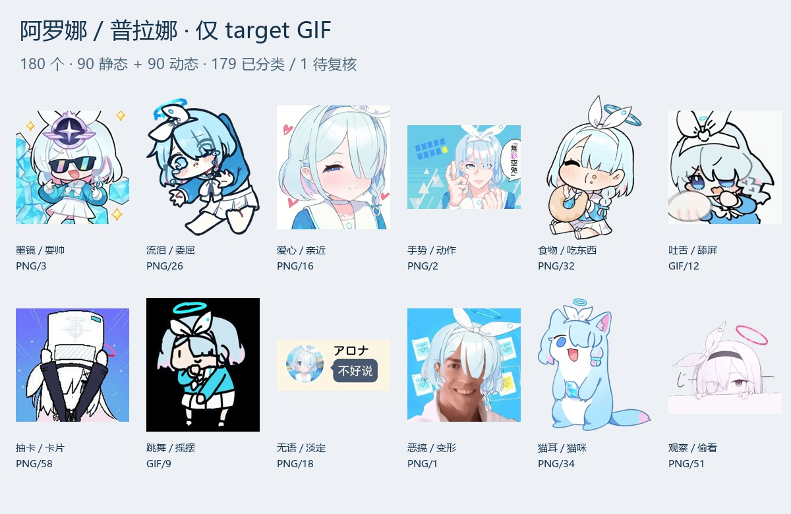

# 阿罗娜 / 普拉娜 · target 语义表情包

本版本仅使用用户提供的三个压缩包中 `target/` 里的 GIF，完整保留原始文件字节，不使用 `source/`、WebP 或 WebM。



- 输入：182 个 target GIF；字节完全相同及逐帧像素完全相同的重复均为 0。
- 目视确认合并两组相同静态画面：PNG/9 → PNG/21；PNG/43 → PNG/53。
- 保留：180 个 GIF，90 个单帧静态、90 个多帧动态。
- 重新分类：179 个；待用户复核：1 个。
- 用户填写的 14 条说明已保存，其中 13 项按用户备注及原 GIF 修正；PNG/39 的生气/害羞含义未证实，暂留待复核。ARONA/5 只记录咬黑球动作，不猜测球的身份。
- 中文描述、可见文字、分类和内容哈希均与原包名及 target 编号逐项绑定。语义描述只记录可确认的画面，避免猜测情绪、物品或梗义。
- `needs_review` 是审核分类，在上游插件中不参与聊天分类匹配。

## 查看分类与复核

用浏览器打开 [review.html](review.html)，可以直接播放原始 GIF。默认显示待复核项，也可查看全部并搜索编号。页面的分类调整可导出 JSON；在导出前关闭或刷新页面会丢失调整。也可直接告诉整理者：`GIF/15 → 具体分类或含义`。

[classification_catalog.csv](classification_catalog.csv) 是逐项对照表；[review_queue.json](review_queue.json) 是集中复核清单。`previews/` 中每个分类都有带原编号的联系表。

[human_review.json](human_review.json) 保存用户原始备注；[research_review.json](research_review.json) 保存逐项处理结果、搜索来源和仍未确认的内容。「会赢喔」的反讽/失败旗用法参照[梗义说明](https://moegirl.uk/会赢的)；其他已处理项基于用户备注及 target 画面，不冒充已找到原作者解释。

## 安装

采用 [参考仓库](https://github.com/DDZS987/astrbot-meme-pack-semantic-01) 的 AstrBot Meme Pack v2 目录与语义格式。

```yaml
repo: wzken/astrbot-meme-pack-arona-plana
ref: v1.0.0
subpath: .
```

也可导入 `astrbot-meme-pack-arona-plana-v1.0.0.zip`。清单与 `memes/` 位于 ZIP 根目录；不含本机向量、模型配置或密钥。

`memes/<category>/<原包简称>_<target文件名>` 保留可核对的原始编号。`deduplication_report.json` 记录去重依据、保留与合并项、每个 GIF 的哈希和帧数。不同表情、动作、背景或颜色的变体保留。

本包为社区整理包；原始权利与来源说明见 [NOTICE.md](NOTICE.md) 与 [LICENSE.md](LICENSE.md)。
